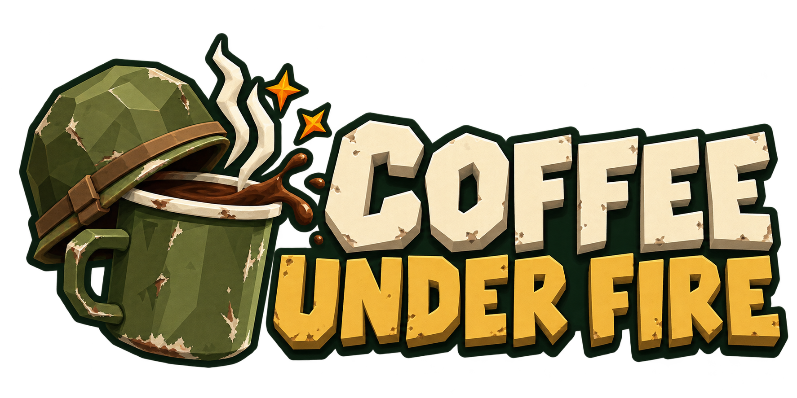

<p align="center">
  <a href="https://coffee.yardsort.sh/">
    
  </a>
</p>

# Coffee Under Fire

**[Play Coffee Under Fire](https://coffee.yardsort.sh/)**

A React + Three.js coffee-delivery arena shooter. Every enemy plans its own tactics from what it can see, hear and remember, using a local utility scorer over legal actions; deterministic TypeScript executes the action. Read COFFEE_UNDER_FIRE_GDD.md for the design.

## Run locally

Requires Node **24.x**. Install with `npm ci`, then start the game and its local server. No API keys or external services are needed:

```sh
npm run dev
```

Build and test:

```sh
npm run build
npm test
```

Build before tests so the production startup test exercises the built application.

Open http://127.0.0.1:5173. Server binds loopback port 8787; 3000 is reserved. WASD move, mouse aim/shoot, R reload, E hold to collect/deliver, Space dodge, Escape pause. The first patrol is telegraphed at five seconds and arrives at six. Five deliveries alone do not end the finite mission: survive eight minutes. Endless mode is also available.

## Architecture

See [How enemy tactics work](docs/npc-tactics.md) for perception, scoring, execution and replay. Enemy tactics previously came from TypeSafe's Jev model; [the decision record](docs/decisions/local-tactics.md) explains why that was retired. The last Jev version is tagged `jev-concept` locally.

- packages/shared: versioned validation contracts
- apps/server: game sessions and leases, invite/guest access, leaderboard and owner console
- apps/web/src/game: fixed-step simulation, perception, candidate enumeration, local tactics, collision/navigation and recorded-decision replay
- apps/web/src/render: Three.js scene; transforms updated directly
- tests: mechanics, legality and failure fixtures

The decision inspector exports seed, player inputs and applied decisions. `replay(recording)` replays them headlessly within this build; records are not promised compatible across builds. Shared map layout lives in `packages/shared/map-layout.json`; Blender scenery and verified markers use those same coordinates.

This is an experimental game. Dated phase and playtest reports under `docs/` record the evidence at each stage, including the earlier Jev-based work. The hosted game can remain invite-only even when source code is public.

## Share a development playtest deliberately

Development binds to **127.0.0.1:5173** by default. Do not expose the development server as a public game host: it bypasses production access controls. Prefer the production deployment for invited testers.

For a temporary trusted tunnel, restart Vite with the exact assigned tunnel hostname in the shell environment:

```sh
DEV_ALLOWED_HOSTS=your-assigned-host.eu.edge.rustunnel.com npm run dev
```

Point the tunnel at `http://127.0.0.1:5173`. Hostnames are comma-separated without schemes, ports, leading dots or wildcards; a newly assigned hostname requires restarting Vite. Keep the tunnel's incoming Host header. `/api` is proxied to the loopback backend on 8787. These settings do not add authentication to development. Close the tunnel when finished.

## Blender technical sample

```
npm run assets:generate
npm run assets:verify
```

The generator uses the locally discovered Steam Blender executable. Set `BLENDER_BIN` to override its path. It runs in a separate background Blender process and creates named sample scenes. Editable sources are under `assets/blender`; runtime exports are under `apps/web/public/assets/models`. Visit http://127.0.0.1:5173/asset-preview for the idle/run crossfade. `assets/manifest.json` records measured geometry, bounds and clips. The sample is deliberately blocky; it is not the final character set.

[Phase checkpoint](docs/benchmarks/phase-report.md) distinguishes verified work from unpassed live, playtest and asset gates.

## Playable art exports

The current mission uses the Blender player, three rifleman appearances, general, later-wave light tank, landmarks and battered outpost map. The commands above retain the original technical sample. To rebuild the playable assets:

```sh
npm run assets:slice
npm run assets:npcs
npm run assets:map
npm run assets:tank
npm run assets:slice:verify
npm run assets:npcs:verify
npm run assets:map:verify
npm run assets:tank:verify
```

`/asset-preview` includes character/clip selectors, map inspection and a labelled 13-character animation fixture with an FPS readout. See [NPC pass evidence](docs/art/npc-pass-01.md) for sources, measured asset budgets and validation limits.

## Battlefield playtest

Infantry arrive in larger groups early (30 HP unchanged). From wave 4 the director can replace one spawn with a light tank, within the shared 14-enemy cap and one-tank maximum. Dodge away from its fixed orange aiming line; cover blocks the shell. `/asset-preview` → **Preview tank effects** includes a labelled offline loop for moving treads, cannon recoil and destruction, with **Enable tank sound** and **Destroy preview tank** controls. See [scheduling and tank polish](docs/decisions/playtest-09.md) for verification and live measurements.

Earlier synthetic-player measurements from the Jev era are recorded in [battlefield evidence](docs/decisions/playtest-08.md); their measurement scripts were removed with the Jev integration.

The illustrated briefing and HUD use the project logo in `apps/web/public/assets/brand/coffee-under-fire-logo-v1.png`. See [briefing art and recovery evidence](docs/decisions/playtest-10.md) and [logo prompt/provenance](docs/art/briefing-logo-01.md).

Background music is an original synthesized instrumental with a separate **Music** toggle on the briefing and HUD. Rebuild the loop with `npm run assets:music`; see [composition and playback notes](docs/art/music-01.md). The briefing's **Every enemy thinks for itself** callout opens the tactics dashboard.

Choose **Easy**, **Normal** or **Hard** in the briefing for either game mode. Easy is preselected and reduces enemy numbers and incoming damage; Normal retains the previous balance; Hard sends larger groups sooner. Tanks can arrive from **wave 4 (about three minutes)**, independently of XP level. Difficulty also sets enemy fire discipline (how often an available shot is taken) and is recorded with decision replays; see [preset details](docs/decisions/playtest-11.md) and [tactics](docs/npc-tactics.md).

## Battlefields and tank balance

Choose **Little Outpost** or **Ruined Village** in the briefing. Both maps use their own shared layout for rendered cover, collision, perception and navigation. Replay records the selected map and armor profile; older records default to woodland and retain historical tank behavior. New tanks have 150/200/240 health on Easy/Normal/Hard, with spaced multi-tank groups in later waves. See `docs/decisions/playtest-12.md` for quotas and validation limits.

Generate and verify the editable village and runtime export:

```
npm run assets:village
npm run assets:village:verify
```

`/asset-preview` has a Ruined Village inspection button.

## Private Render deployment

`render.yaml` prepares a single production Node service serving the built game and API behind per-invite passwords. See [setup and access management](docs/deployment/admin.md). The owner console manages hashed invite passwords, simultaneous-game limits, login history and estimated play time. The prepared deployment requires a persistent disk and an owner token; development binds to loopback by default. Follow the deployment guide for access configuration.

Optional support: set `VITE_SUPPORT_URL` to your actual Ko-fi or Buy Me a Coffee page and rebuild. Blank hides the callout. Donations are entirely optional and only appear on the briefing and mission report.

## License and contributing

Original code, documentation, procedural Blender assets/exports and synthesized music are offered under [MIT](LICENSE). See [licensing scope and release checklist](docs/open-source-readiness.md) for the generated logo provenance and third-party exclusions.

Read [CONTRIBUTING.md](CONTRIBUTING.md) before submitting changes and [SECURITY.md](SECURITY.md) to report vulnerabilities privately. Publication remains a separate release step; adding a license does not change repository visibility.

## Public guest play

Optional signup-free guest access is controlled from `/admin`. It defaults off and requires server-validated Turnstile and a trusted network configuration. Guests get one game at a time, with per-network concurrency and daily new-guest limits. See [public play setup and limitations](docs/deployment/public-play.md).

## Sharing and leaderboard

End-game reports include native social sharing (with X/WhatsApp/copy fallbacks) and optional public nickname submission. `/leaderboard` shows the top 20 best scores per player for each map/difficulty/mode. Rankings are explicitly community-reported, not anti-cheat verified. See [leaderboard integrity, moderation and deployment](docs/deployment/leaderboard.md).
